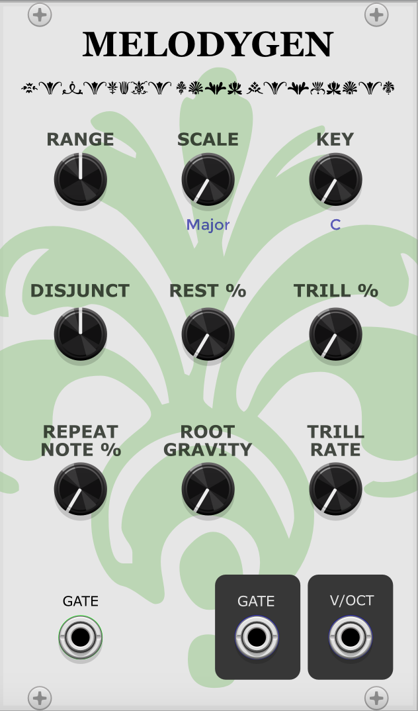

# SS-MODULES

## Description

This is a plugin for VCV Rack that adds a collection of modules. So far, there is
only one module: Melodygen. Melodygen is a melody generator with unique parameters
such as trilling, melody disjunct/conjuntion, and root gravity.

## Installation

1. Clone this repository.
2. Navigate to the folder.
3. Run `make` to compile.
4. Copy the generated plugin folder to your Rack `plugins` folder.

## Dependencies

- VCV Rack SDK

## License

This plugin is licensed under the GNU General Public License v3.0 or later (GPL-3.0-or-later). For more information, see the [LICENSE](./LICENSE) file.

## Author

Samuel Strong

---

If you find this plugin useful, consider starring the repository.
